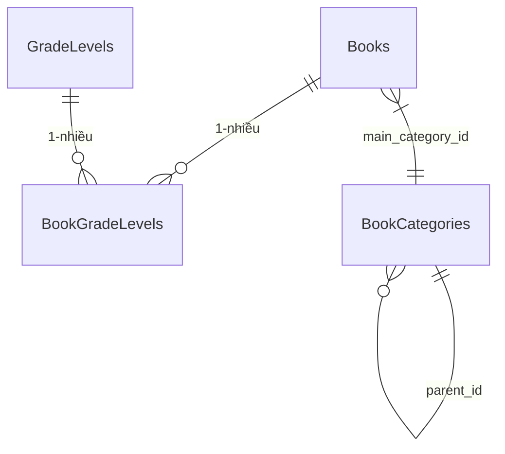
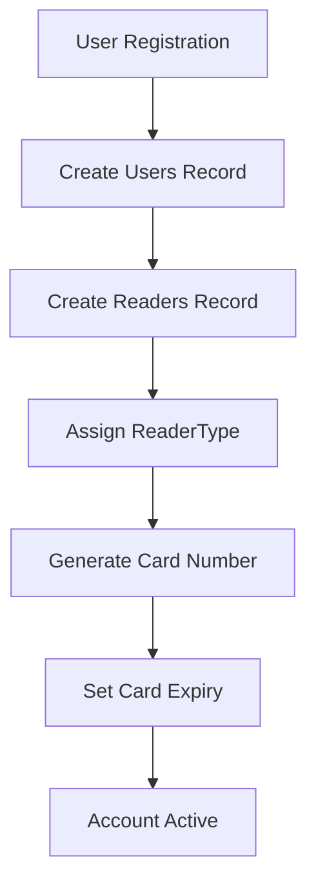
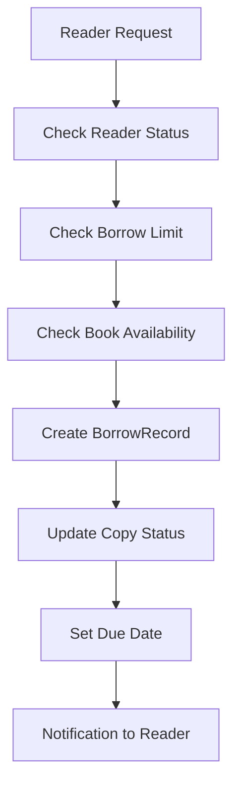
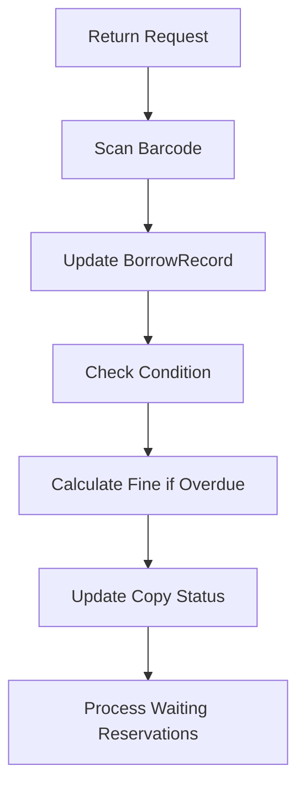
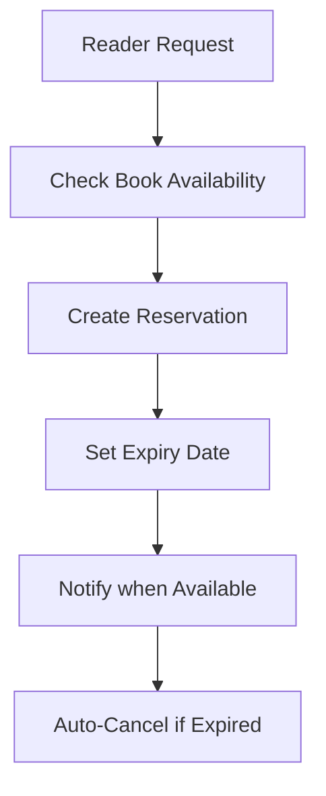

# 📚 Hệ thống Quản lý Thư viện - System Architecture

## 🎯 Tổng quan Hệ thống

Hệ thống Quản lý Thư viện là một ứng dụng web hiện đại được thiết kế để quản lý toàn bộ hoạt động của thư viện, bao gồm:

- **Quản lý người dùng**: Admin và độc giả với các quyền khác nhau
- **Quản lý sách**: Hỗ trợ cả sách vật lý và sách điện tử
- **Quản lý hình ảnh**: Upload và quản lý hình ảnh lên Cloudinary
- **Quản lý file PDF**: Upload và quản lý file PDF cho tài liệu
- **Quản lý mượn/trả**: Quy trình mượn trả sách với tracking chi tiết
- **Hệ thống đặt trước**: Cho phép độc giả đặt trước sách
- **Quản lý phạt**: Tự động tính phạt cho sách trả muộn
- **Báo cáo và thống kê**: Theo dõi hoạt động thư viện

## 🏗️ Kiến trúc Database

### 📊 Database Schema Overview

```
🔑 Core Entities: 19 tables
👥 User Management: 3 tables (Users, ReaderTypes, Readers)
📚 Book Management: 10 tables (Books, Authors, Categories, Publishers, BookAuthors, PhysicalCopies, EBooks, GradeLevels, BookCategories, BookGradeLevels)
🖼️ Media Management: 2 tables (Images, Uploads)
🔄 Transaction Management: 4 tables (BorrowRecords, Reservations, Renewals, Fines)
```

### 🗂️ Entity Categories

#### 1. **User Management Layer**

```sql
Users → ReaderTypes → Readers
```

- **Users**: Hệ thống authentication và authorization
- **ReaderTypes**: Phân loại độc giả (student, teacher, staff)
- **Readers**: Thông tin chi tiết độc giả

#### 2. **Content Management Layer**

```sql
Books ← BookAuthors → Authors
Books → Categories
Books → Publishers
Books → PhysicalCopies
Books → EBooks
Books ↔ BookGradeLevels ↔ GradeLevels
Books → BookCategories
BookCategories → BookCategories   -- self-referential via parent_id
```

- **Books**: Thông tin sách cơ bản
- **Authors**: Quản lý tác giả
- **BookAuthors**: Quản lý tác giả và sách
- **Categories**: Phân loại sách
- **Publishers**: Nhà xuất bản
- **PhysicalCopies**: Bản sao vật lý
- **EBooks**: Sách điện tử
- **GradeLevels**: Khối lớp (Lớp 1, Đại học, ...)
- **BookCategories**: Thể loại chi tiết (Sách Toán, Công nghệ, ...)
- **BookGradeLevels**: Bảng liên kết Sách - Khối lớp

#### 3. **Media Management Layer**

```sql
Images
Uploads
```

- **Images**: Quản lý hình ảnh (book covers, library photos, etc.)
- **Uploads**: Quản lý file PDF (tài liệu, sách điện tử, etc.)

#### 4. **Transaction Management Layer**

```sql
BorrowRecords → Renewals
BorrowRecords → Fines
Reservations
```

- **BorrowRecords**: Lịch sử mượn sách
- **Reservations**: Đặt trước sách
- **Renewals**: Gia hạn sách
- **Fines**: Quản lý phạt

## 📋 Chi tiết Entities

### 👥 User Management

#### **Users Table**

```typescript
interface User {
  id: uuid;
  username: string; // Unique username
  password: string; // Hashed password
  email: string; // Email address
  role: 'admin' | 'reader'; // User role
  account_status: 'active' | 'suspended' | 'banned';
  created_at: datetime;
  last_login: datetime;
}
```

#### **ReaderTypes Table**

```typescript
interface ReaderType {
  id: uuid;
  type_name: 'student' | 'teacher' | 'staff';
  max_borrow_limit: number; // Số sách tối đa được mượn
  borrow_duration_days: number; // Thời gian mượn (ngày)
}
```

#### **Readers Table**

```typescript
interface Reader {
  id: uuid;
  user_id: uuid; // Link to Users
  reader_type_id: uuid; // Link to ReaderTypes
  full_name: string;
  dob: date;
  gender: 'male' | 'female' | 'other';
  address: string;
  phone: string;
  card_number: string; // Unique card number
  card_issue_date: date;
  card_expiry_date: date;
  is_active: boolean;
}
```

### 📚 Book Management

#### **Books Table**

```typescript
interface Book {
  id: uuid;
  title: string;
  isbn: string; // Unique ISBN
  publish_year: number;
  edition: string;
  description: string;
  cover_image_id: uuid; // Link to Images table
  language: string;
  page_count: number;
  book_type: 'physical' | 'ebook';
  physical_type: 'library_use' | 'borrowable'; // Chỉ cho sách vật lý
  publisher_id: uuid;
  category_id: uuid;
  main_category_id: uuid; // Link to BookCategories (thể loại chính)
}
```

#### **Authors Table**

```typescript
interface Author {
  id: uuid;
  author_name: string;
  bio: string;
  nationality: string;
}
```

#### **BookAuthors Table**

```typescript
interface BookAuthor {
  id: uuid; // ID duy nhất của bản ghi
  book_id: uuid; // Liên kết đến sách
  author_id: uuid; // Liên kết đến tác giả
}
```

- **Mô tả**: Bảng này lưu trữ mối quan hệ giữa sách và tác giả, cho phép một sách có nhiều tác giả và một tác giả có thể viết nhiều sách.
- **Khóa ngoại**:
  - `book_id`: Liên kết đến bảng `Books`.
  - `author_id`: Liên kết đến bảng `Authors`.
- **Quy tắc**: Mỗi bản ghi trong bảng này đại diện cho một mối quan hệ giữa một sách và một tác giả.

#### **Categories Table**

```typescript
interface Category {
  id: uuid;
  category_name: string;
  description: string;
}
```

#### **GradeLevels Table**

```typescript
interface GradeLevel {
  id: uuid;
  name: string; // Unique (ví dụ: "Lớp 1", "Đại học")
  description: string;
  order: number; // Sắp xếp hiển thị
}
```

#### **BookCategories Table**

```typescript
interface BookCategory {
  id: uuid;
  name: string; // Unique (ví dụ: "Sách Toán", "Sách Công nghệ")
  parent_id: uuid | null; // Danh mục cha (self-reference)
}
```

#### **BookGradeLevels Table**

```typescript
interface BookGradeLevel {
  book_id: uuid; // Ref → Books.id
  grade_level_id: uuid; // Ref → GradeLevels.id
  // Composite primary key: (book_id, grade_level_id)
}
```

#### **Publishers Table**

```typescript
interface Publisher {
  id: uuid;
  publisher_name: string;
  address: string;
  phone: string;
  email: string;
}
```

#### **PhysicalCopies Table**

```typescript
interface PhysicalCopy {
  id: uuid;
  book_id: uuid;
  barcode: string; // Unique barcode
  status:
    | 'available'
    | 'borrowed'
    | 'reserved'
    | 'damaged'
    | 'lost'
    | 'maintenance';
  current_condition: 'new' | 'good' | 'worn' | 'damaged';
  condition_details: string;
  purchase_date: date;
  purchase_price: decimal;
  location: string; // Vị trí trong thư viện
  notes: string;
  last_checkup_date: date;
  is_archived: boolean;
}
```

#### **EBooks Table**

```typescript
interface EBook {
  id: uuid;
  book_id: uuid;
  file_path: string;
  file_size: number;
  file_format: string;
  download_count: number;
}
```

### 🖼️ Media Management

#### **Images Table**

```typescript
interface Image {
  id: uuid;
  original_name: string; // Tên gốc image (ví dụ: "hình ảnh mẫu.jpg")
  file_name: string; // Tên image đã đổi (ví dụ: "hinh-anh-mau.jpg")
  slug: string; // Slug từ tên image (ví dụ: "hinh-anh-mau")
  cloudinary_url: string; // URL của image trên Cloudinary
  cloudinary_public_id: string; // Public ID của image trên Cloudinary
  file_size: number; // Kích thước image (bytes)
  mime_type: string; // MIME type (image/jpeg, image/png, etc.)
  width?: number; // Chiều rộng image (pixels)
  height?: number; // Chiều cao image (pixels)
  format: string; // Format của image (jpg, png, etc.)
  created_at: datetime;
  updated_at: datetime;
}
```

#### **Uploads Table**

```typescript
interface Upload {
  id: uuid;
  original_name: string; // Tên gốc file (ví dụ: "tài liệu mẫu.pdf")
  file_name: string; // Tên file đã đổi (ví dụ: "tai-lieu-mau.pdf")
  slug: string; // Slug từ tên file (ví dụ: "tai-lieu-mau")
  file_path: string; // Đường dẫn file (ví dụ: "files/tai-lieu-mau.pdf")
  file_size: number; // Kích thước file (bytes)
  mime_type: string; // MIME type (application/pdf)
  created_at: datetime;
  updated_at: datetime;
}
```

### 🔄 Transaction Management

#### **BorrowRecords Table**

```typescript
interface BorrowRecord {
  id: uuid;
  reader_id: uuid;
  copy_id: uuid; // Physical copy ID
  borrow_date: datetime;
  due_date: datetime;
  return_date: datetime;
  status: 'borrowed' | 'returned' | 'overdue' | 'renewed';
  librarian_id: uuid; // Who processed the transaction
}
```

#### **Reservations Table**

```typescript
interface Reservation {
  id: uuid;
  reader_id: uuid;
  book_id: uuid;
  reservation_date: datetime;
  expiry_date: datetime;
  status: 'pending' | 'fulfilled' | 'cancelled' | 'expired';
}
```

#### **Renewals Table**

```typescript
interface Renewal {
  id: uuid;
  borrow_id: uuid;
  renewal_date: datetime;
  new_due_date: datetime;
  librarian_id: uuid;
}
```

#### **Fines Table**

```typescript
interface Fine {
  id: uuid;
  borrow_id: uuid;
  fine_amount: decimal;
  fine_date: datetime;
  reason: string;
  status: 'unpaid' | 'paid';
  payment_date: datetime;
}
```

## 🔗 Relationships & Constraints

### **Primary Relationships**

1. **Users → Readers**: One-to-One relationship
2. **ReaderTypes → Readers**: One-to-Many relationship
3. **Books → PhysicalCopies**: One-to-Many relationship
4. **Books → EBooks**: One-to-Many relationship
5. **Books ↔ Authors**: Many-to-Many (via BookAuthors)
6. **Books → Images**: Many-to-One relationship (cover images)
7. **EBooks → Uploads**: Many-to-One relationship (PDF files)
8. **Books ↔ GradeLevels**: Many-to-Many (via BookGradeLevels)
9. **Books → BookCategories**: Many-to-One (main_category_id)
10. **BookCategories → BookCategories**: One-to-Many self-referential (parent_id)
11. **Readers → BorrowRecords**: One-to-Many relationship
12. **PhysicalCopies → BorrowRecords**: One-to-Many relationship
13. **BorrowRecords → Renewals**: One-to-Many relationship
14. **BorrowRecords → Fines**: One-to-Many relationship



### **Key Constraints**

- **UUID Primary Keys**: Tất cả tables sử dụng UUID
- **Unique Constraints**: username, email, card_number, barcode, isbn, file_name, slug, GradeLevels.name, BookCategories.name
- **Composite Primary Keys**: BookGradeLevels(book_id, grade_level_id)
- **Enum Constraints**: role, account_status, book_type, status fields
- **Foreign Key Constraints**: Đảm bảo referential integrity
- **Indexes**: Optimize queries cho borrow_status, due_date, slug, book_category, grade_level

## 🚀 Business Logic & Rules

### **Reader Management Rules**

1. **Reader Types có giới hạn mượn khác nhau**:
   - Student: Thường 3-5 cuốn
   - Teacher: 10-15 cuốn
   - Staff: 5-10 cuốn

2. **Card Management**:
   - Mỗi reader có card_number unique
   - Card có expiry_date
   - Chỉ active readers mới được mượn

### **Book Management Rules**

1. **Book Types**:
   - `physical`: Sách vật lý
   - `ebook`: Sách điện tử

2. **Physical Types**:
   - `library_use`: Chỉ đọc tại thư viện
   - `borrowable`: Có thể mượn về

3. **Copy Status Management**:
   - `available` → `borrowed` → `available`
   - `reserved` → `borrowed`
   - `damaged`/`lost`/`maintenance` → không available

### **Borrowing Rules**

1. **Borrow Limits**: Dựa trên ReaderType
2. **Due Date**: Tự động tính theo borrow_duration_days
3. **Overdue Detection**: Status tự động chuyển thành 'overdue'
4. **Renewal Rules**: Có thể gia hạn nếu không có reservation

### **Fine Calculation**

1. **Overdue Fines**: Tự động tính theo số ngày trễ
2. **Damage Fines**: Manual entry bởi librarian
3. **Lost Book Fines**: Theo giá trị sách

### **Image Management Rules**

1. **Image Upload**:
   - Chỉ cho phép file types: JPEG, PNG, GIF, WebP
   - Kích thước tối đa: 10MB
   - Tự động tạo slug từ tên file gốc
   - Upload lên Cloudinary với optimization

2. **Image Storage**:
   - Cloudinary folder: `quan-ly-thu-vien-cua-duong`
   - Tự động optimization: quality auto, format auto
   - Tracking đầy đủ metadata (size, dimensions, format)

3. **Image Access**:
   - URL access qua Cloudinary CDN
   - Transformation support (resize, crop, quality)
   - Slug-based URL routing

### **File Upload Management Rules**

1. **File Upload**:
   - Chỉ cho phép file types: PDF (application/pdf)
   - Kích thước tối đa: 20MB
   - Tự động tạo slug từ tên file gốc
   - Lưu trữ có tổ chức trong thư mục `files/`

2. **File Storage**:
   - Local storage trong thư mục `files/`
   - Naming convention: `{slug}.pdf`
   - Path structure: `files/{slug}.pdf`
   - Có thể migrate lên cloud storage (AWS S3, Google Cloud)

3. **File Access**:
   - Multiple access methods: ID, slug, direct path
   - Download functionality với proper headers
   - Direct file serving với caching
   - Flexible URL routing

## 📊 System Workflows

### **1. User Registration & Authentication**



### **2. Book Borrowing Process**



### **3. Book Return Process**



### **4. Reservation System**



## 🔍 Key Features & Capabilities

### **1. Advanced Search & Discovery**

- Full-text search qua title, author, ISBN
- Filter theo category, publisher, language
- Advanced search với multiple criteria
- Recommendation system

### **2. Inventory Management**

- Real-time tracking của copy status
- Automatic availability updates
- Condition monitoring
- Purchase tracking

### **3. Reader Management**

- Flexible reader types với different privileges
- Card management system
- Activity tracking
- Fine management

### **4. Image Management**

- Cloudinary integration cho image storage
- Automatic image optimization
- Slug-based URL routing
- Image transformation support
- Book cover management

### **5. File Management**

- PDF upload và storage management
- Slug-based file organization
- Multiple access methods (ID, slug, direct path)
- Download tracking và statistics
- Integration với EBooks module

### **6. Analytics & Reporting**

- Popular books tracking
- Reader activity reports
- Overdue book reports
- Fine collection reports
- Inventory utilization
- File download statistics

### **7. Digital Library Support**

- EBook management
- File format support
- Download tracking
- Digital rights management

## 🛡️ Security & Data Protection

### **Data Security**

- Password hashing
- UUID-based IDs (không sequential)
- Role-based access control
- Session management

### **Privacy Protection**

- Reader data encryption
- Audit trails
- Data retention policies
- GDPR compliance ready

## 🚀 Performance Optimization

### **Database Indexes**

```sql
-- Critical indexes for performance
CREATE INDEX borrow_status_index ON BorrowRecords(reader_id, status);
CREATE INDEX due_date_index ON BorrowRecords(due_date);
CREATE INDEX book_type_index ON Books(book_type, physical_type);
CREATE INDEX images_slug_idx ON Images(slug);
CREATE INDEX images_created_at_idx ON Images(created_at);
CREATE INDEX images_file_name_idx ON Images(file_name);
CREATE INDEX images_cloudinary_public_id_idx ON Images(cloudinary_public_id);
CREATE INDEX uploads_slug_idx ON Uploads(slug);
CREATE INDEX uploads_created_at_idx ON Uploads(created_at);
CREATE INDEX uploads_file_name_idx ON Uploads(file_name);
-- New indexes for classification tables
CREATE INDEX book_grade_levels_book_id_idx ON BookGradeLevels(book_id);
CREATE INDEX book_grade_levels_grade_level_id_idx ON BookGradeLevels(grade_level_id);
CREATE INDEX book_categories_parent_id_idx ON BookCategories(parent_id);
-- Helpful indexes for lookups
CREATE INDEX books_main_category_idx ON Books(main_category_id);
-- Uniqueness constraints via indexes
CREATE UNIQUE INDEX grade_levels_name_unique_idx ON GradeLevels(name);
CREATE UNIQUE INDEX book_categories_name_unique_idx ON BookCategories(name);
-- Composite primary key for mapping table (if not defined in DDL)
-- ALTER TABLE BookGradeLevels ADD PRIMARY KEY (book_id, grade_level_id);
```

### **Query Optimization**

- Pagination cho large datasets
- Efficient joins với proper indexing
- Caching cho frequently accessed data
- Database connection pooling

## 📈 Scalability Considerations

### **Horizontal Scaling**

- Read replicas cho reporting
- Sharding strategies cho large datasets
- CDN cho book covers và ebook files
- Cloudinary CDN cho image delivery
- Cloud storage cho file management

### **Vertical Scaling**

- Memory optimization
- CPU optimization cho search queries
- Storage optimization cho file management
- Image processing optimization
- File compression và optimization

## 🔧 Integration Points

### **External Systems**

- **Email Service**: Notifications và reminders
- **SMS Service**: Overdue notifications
- **Payment Gateway**: Fine payments
- **Barcode Scanner**: Physical copy management
- **Digital Library APIs**: EBook integration
- **Cloudinary**: Image storage và optimization
- **Cloud Storage**: File storage (AWS S3, Google Cloud)

### **API Endpoints**

- RESTful API cho all operations
- GraphQL support cho complex queries
- WebSocket cho real-time notifications
- Webhook support cho integrations
- Image upload endpoints với multipart/form-data
- File upload endpoints với multipart/form-data

## 📝 Future Enhancements

### **Phase 1 - Core Features**

- ✅ Basic CRUD operations
- ✅ Authentication & Authorization
- ✅ Borrowing & Return system
- ✅ Fine management
- ✅ Image upload và management
- ✅ File upload và management
- ✅ Grade levels & detailed categories (DB schema)

### **Phase 2 - Advanced Features**

- 📋 Mobile app support
- 📋 Advanced analytics
- 📋 Integration với external systems
- 📋 AI-powered recommendations
- 📋 Advanced image processing (AI cropping, multiple formats)
- 🗂️ File compression và optimization
- 🔎 Advanced search/filter theo GradeLevels & BookCategories

### **Phase 3 - Enterprise Features**

- 📋 Multi-library support
- 📋 Advanced reporting
- 📋 Workflow automation
- 📋 Enterprise integrations
- 📋 Image analytics và access control
- 📋 Cloud storage migration

---

## 📞 Technical Support

**Database Schema Version**: 1.3
**Last Updated**: 2024-01-01
**Schema Complexity**: 19 tables, 25+ relationships
**Estimated Records**:

- Books: 10,000+
- Readers: 5,000+
- Images: 5,000+
- Uploads: 3,000+
- Transactions: 50,000+/year

**Performance Targets**:

- Search Response: < 200ms
- Borrow Transaction: < 500ms
- Report Generation: < 2s
- Image Upload: < 3s (10MB)
- Image URL Generation: < 100ms
- File Upload: < 2s (20MB)
- File Download: < 1s
- Concurrent Users: 100+
